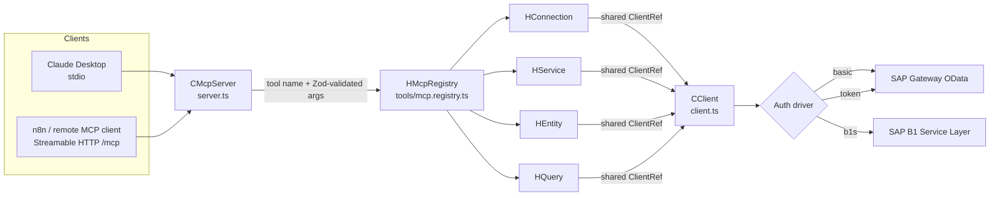

# SAP OData MCP Server

A **Model Context Protocol (MCP) server** that lets AI assistants and agent platforms (Claude, n8n AI agents, any MCP-compatible client) read and write data in **SAP** systems through their standard **OData REST APIs**.

It works with two SAP families:

- **SAP NetWeaver Gateway OData** (SAP ECC / S/4HANA and any system that exposes services under `/sap/opu/odata/...`)
- **SAP Business One Service Layer** ("B1S", the REST/OData API of SAP Business One)

---

## 1. What this project is

### Business view

ERP data is usually locked behind SAP GUI screens, custom ABAP reports or one-off integrations built for a single use case. This project gives AI agents **one generic, secure way into SAP**, so a business user or an automated workflow can ask things like:

- *"Show me the open purchase requests for supplier X"*
- *"What's the stock level of item A-1001?"*
- *"Create a business partner with this data"*
- *"Run the saved query `OPEN_ORDERS` and summarize it"*

Nobody has to build a new integration for each of these questions. The agent discovers which services exist, reads their metadata, and then queries or changes records itself.

**Value proposition**

| For | Benefit |
|---|---|
| Business users | Natural-language access to ERP data through Claude or chat-based n8n workflows |
| Automation teams | A ready-made SAP "toolbox" for n8n AI-agent nodes, with no per-flow HTTP plumbing |
| IT / SAP teams | Uses the **existing OData layer and SAP authorizations**. No SAP RFC SDK, no ABAP changes, no direct DB access. |
| Multi-tenant setups | Credentials can be passed on every call, so one server instance can serve several SAP systems or company databases |

### Functional view

The server exposes **11 MCP tools**, grouped into four domains:

| Domain | Tools | What they do |
|---|---|---|
| **Connection** | `sap_connect`, `sap_connection_status`, `sap_disconnect` | Open, inspect and close an authenticated SAP session |
| **Service discovery** | `sap_services_get`, `sap_service_metadata_get` | List the available OData services, and read a service's entities, properties and function imports |
| **Entity (CRUD)** | `sap_entity_get`, `sap_entity_create`, `sap_entity_update`, `sap_entity_delete` | Read, create, update or delete a single record by its key |
| **Query** | `sap_query_entity_set`, `sap_call_function` | Filtered, sorted, paginated list queries, and OData function imports (including key-bound ones such as B1S `SQLQueries('X')/List`) |

A typical agent session looks like this: **discover services → inspect metadata → query / read → create / update**.

---

## 2. Technology stack

| Technology | Version | Purpose in this project |
|---|---|---|
| **Node.js** | ≥ 18 (container uses `node:22-alpine`) | Runtime |
| **TypeScript** | 5.x, `strict` mode, target ES2022 / CommonJS | Implementation language |
| **`@modelcontextprotocol/sdk`** | ^1.29 | MCP protocol implementation: `McpServer`, `StdioServerTransport`, `StreamableHTTPServerTransport` |
| **Zod** | ^3.22 | Runtime validation of every tool input, and the source of the JSON Schema that MCP clients see. It also reads `SAP_*` env-var defaults into the connection config. |
| **Axios** | ^1.6 | HTTP client for SAP OData calls. Auth drivers attach request/response **interceptors** for headers, cookies and CSRF tokens. |
| **xml2js** | ^0.6 | Parses OData `$metadata` (EDMX XML) into entity, property and function lists |
| **dotenv** | ^16 | Loads environment configuration |
| **Node `http` / `https` / `crypto`** | built-in | HTTP server for the Streamable HTTP transport, SSL-validation toggle, and session UUIDs |
| **tsc + tsc-alias** | | Build. `tsc-alias` rewrites the `@/*` import alias in `dist/`. |
| **tsx** | ^4 | Runs TypeScript directly in development (`npm run dev`) |
| **Jest + ts-jest** | ^29 | Unit tests. `jest.config.js` maps `@/*` to `src/*`. |
| **ESLint 9 (flat config) + typescript-eslint, Prettier** | | Linting and formatting |
| **Docker / Docker Compose** | | Development container on a shared external network |

---

## 3. Architecture

### 3.1 High-level flow



### 3.2 Layers

The code follows a **layered, domain-oriented design**. Each layer has one job:

| Layer | Class prefix | Responsibility | Where |
|---|---|---|---|
| **Transport / server** | `C` | Starts the MCP server in stdio or HTTP mode, manages HTTP sessions and registers the tools | [app/src/server.ts](app/src/server.ts) |
| **Registry (router)** | `H` | Owns the handlers and the shared connection state, and maps each tool name to a handler method | [app/src/tools/mcp.registry.ts](app/src/tools/mcp.registry.ts) |
| **Schemas** | `S` | Zod input schemas: the single source of truth for validation and for the tool's JSON Schema | `app/src/tools/*/schema.ts` |
| **Tool definitions** | | The `Tool` name and the LLM-facing **description** (usage guidance for the model) | `app/src/tools/*/definitions/*.ts` |
| **Handlers** | `H` | Business logic: make sure a connection exists, call the client, shape the text response for the LLM | `app/src/tools/*/handler.ts` |
| **Clients** | `C` | Raw SAP HTTP calls: URL building, OData query options, error extraction | `app/src/tools/*/client.ts` |
| **Base client** | `A` | Axios instance, connection lifecycle and verification, SAP error formatting | [app/src/base.client.ts](app/src/base.client.ts) |
| **Auth drivers** | `C` / `A` | Strategy objects that plug authentication into Axios | [app/src/auth/](app/src/auth/) |

### 3.3 Design patterns used

- **Strategy + Factory (auth).** `ABaseDriver` defines the contract (`applyToAxios`, `connect`, `disconnect`, `describe`, `hasCSRFToken`, `onUnauthorized`). `createAuthDriver()` in [app/src/auth/index.ts](app/src/auth/index.ts) picks `CDriverBasic`, `CDriverToken` or `CDriverB1S`, validates the fields that driver needs, and falls back to `basic` for unknown values.
- **Interceptors as middleware.** Each driver adds Axios request/response interceptors. These inject `Authorization` / `sap-client` / `Cookie` headers, capture `X-CSRF-Token` and `Set-Cookie` from responses, and reset state on `401`.
- **Mixin composition (client).** [app/src/client.ts](app/src/client.ts) copies the prototype methods of `CService`, `CEntity` and `CQuery` onto `ABaseClient`, which produces a single `CClient`. All operations share **one Axios instance, one auth session and one CSRF token**, while the code stays split by domain.
- **Shared state through `ClientRef`.** Every handler extends `ABaseHandler` and gets the same `ClientRef { client, metadataCache }`. A connection made by `sap_connect` is therefore visible to every other tool.
- **Lazy / per-call connection.** `ABaseHandler._ensureConnected(connection?)` reuses a live client. If there isn't one, it builds a new client from the tool's `connection` argument, falling back to `SAP_*` environment variables. This is what makes stateless callers such as n8n work: n8n opens a new MCP session for every tool call.
- **Per-session MCP servers (HTTP).** `McpServer.connect()` can only be called once per instance, so the HTTP mode creates a new `McpServer` + `StreamableHTTPServerTransport` for each `initialize` request and tracks it by the `MCP-Session-Id` header.

### 3.4 Request lifecycle (example: `sap_query_entity_set`)

1. The client sends `tools/call` (over stdio, or `POST /mcp` with a session id).
2. The MCP SDK validates the arguments against `SQueryEntitySet` (Zod).
3. `HMcpRegistry.route("sap_query_entity_set")` calls `HQuery.queryEntitySet`.
4. `_ensureConnected(args.connection)` reuses or creates a `CClient`, and the auth driver logs in or fetches a CSRF token.
5. If `select` was given, the handler loads the entity's properties from `$metadata` (cached in `metadataCache` under `service:entitySet`) and removes invalid fields, adding a warning to the response.
6. `CQuery.queryEntitySet` builds the `$select/$filter/$orderby/$top/$skip/$expand` URL. For B1S it adds `B1S-CaseInsensitive: true`.
7. The handler turns the result into LLM-friendly text: record count, max 3 records unless `top` is set, and nested arrays stripped. The full payload is also returned in `_rawData`.
8. On "Unrecognized resource path" / "Resource not found", the handler lists the available entity sets so the model can correct itself.

---

## 4. Repository map: where to look

```
da-sap-mcp/
├── README.md                    ← this file
├── STANDARDS.md                 ← coding rules (naming, ordering, prefixes, aliases) — read before contributing
├── docker-compose.yml           ← dev container "sap-mcp" (bind-mounts ./app, port 3001, external network)
├── hub/node/
│   ├── Dockerfile.local         ← used by compose: node:22-alpine dev shell (vim, mlocate), no CMD
│   └── Dockerfile               ← deps-install image (not wired into compose)
└── app/                         ← the Node/TypeScript project
    ├── package.json             ← scripts & dependencies
    ├── tsconfig.json            ← strict TS, `@/*` → `src/*` path alias
    ├── eslint.config.mjs        ← ESLint flat config (typescript-eslint recommended)
    ├── jest.config.js           ← Jest + ts-jest, alias mapping
    ├── .env.dev                 ← env vars loaded by docker-compose
    └── src/
        ├── index.ts             ← entry point: new CMcpServer().run()
        ├── server.ts            ← transports (stdio / Streamable HTTP), session map, tool registration, toolSchemas
        ├── client.ts            ← CClient = ABaseClient + CService + CEntity + CQuery (mixins)
        ├── base.client.ts       ← ABaseClient: axios, connect/verify, isConnected, SAP error formatting
        ├── base.handler.ts      ← ABaseHandler + ClientRef: shared connection, _ensureConnected()
        ├── odata.types.ts       ← shared types (config, query options, metadata, service list)
        ├── auth/
        │   ├── index.ts         ← createAuthDriver() factory + driver inference
        │   ├── base.driver.ts   ← ABaseDriver contract
        │   ├── driver.basic.ts  ← HTTP Basic + sap-client + CSRF
        │   ├── driver.token.ts  ← Bearer/custom scheme or cookie token + CSRF
        │   └── driver.b1s.ts    ← B1S Login/Logout, B1SESSION cookie handling
        └── tools/
            ├── mcp.registry.ts  ← toolDefinitions list + HMcpRegistry (name → handler)
            ├── connection/      ← schema.ts (SConnection — the connection object), handler.ts, definitions/
            ├── service/         ← discovery & $metadata parsing (client.ts, handler.ts, schema.ts, definitions/)
            ├── entity/          ← single-record CRUD (client.ts, handler.ts, schema.ts, definitions/)
            └── query/           ← entity-set queries & function imports (+ client.test.ts)
```

**Quick pointers**

| I want to… | Look at |
|---|---|
| Change how a tool is described to the LLM | `app/src/tools/<domain>/definitions/*.ts` |
| Add or modify a tool parameter | `app/src/tools/<domain>/schema.ts` |
| Change the text returned to the model | `app/src/tools/<domain>/handler.ts` |
| Change the SAP URL or HTTP call | `app/src/tools/<domain>/client.ts` |
| Add an authentication method | `app/src/auth/` (new driver + factory case) |
| Change transports, CORS or sessions | [app/src/server.ts](app/src/server.ts) |
| Change connection verification or error parsing | [app/src/base.client.ts](app/src/base.client.ts) |

---

## 5. Supported features

### 5.1 Authentication drivers

| Driver | Selected by | Required fields | Behavior |
|---|---|---|---|
| `basic` (default) | `authDriver: "basic"` | `username`, `password` | HTTP Basic auth, optional `sap-client` header, fetches a CSRF token on connect when `enableCSRF` is set |
| `token` | `authDriver: "token"` | `token` | Sends `Authorization: <tokenType> <token>` (default `Bearer`). With `tokenType: "cookie"` it sends the token as a `Cookie` instead. Picks up CSRF tokens and cookies from responses. |
| `b1s` | `authDriver: "b1s"`, or **auto-inferred** when `companyDB` is present | `username`, `password`, `companyDB` | `POST Login` to the Service Layer, keeps the `B1SESSION` cookie, `POST Logout` on disconnect. No CSRF. |

Every driver clears its session or CSRF state when SAP answers `401`.

### 5.2 Connection handling

- **Explicit sessions:** call `sap_connect` once, then use the other tools.
- **Per-call connections:** every tool (except `sap_connect`, `sap_connection_status` and `sap_disconnect`) accepts an optional `connection` object with the same shape as `sap_connect`. Any field that is left out falls back to its `SAP_*` environment variable.
- **Connection verification:** B1S is verified by its login. Gateway is verified through the catalog service first, then by probing the base URL, where a `404` counts as reachable.
- **Health check:** `isConnected()` pings the base URL before an existing client is reused. If the ping fails, the handler reconnects using the call's `connection` object, or asks the caller to run `sap_connect` again.

### 5.3 Service discovery (`sap_services_get`, `sap_service_metadata_get`)

- **B1S:** reads the Service Layer service document to list entity sets.
- **Gateway:** tries `/IWFND/CATALOGSERVICE` (v2 and v1, both casings). If that fails, it probes a list of common services (`GWSAMPLE_BASIC`, `API_BUSINESS_PARTNER`, `API_SALES_ORDER_SRV`, …).
- **Metadata:** parses the `$metadata` EDMX into entity types (property name, type, nullable) and function imports (name, return type).

### 5.4 Entity CRUD

| Tool | HTTP | Notes |
|---|---|---|
| `sap_entity_get` | `GET {path}({keys})` | Optional `expand` (navigation properties) |
| `sap_entity_create` | `POST {path}` | `data` body |
| `sap_entity_update` | `PUT {path}({keys})` | `data` body |
| `sap_entity_delete` | `DELETE {path}({keys})` | |

Keys: numbers are sent as-is (`DocEntry=30526`). Strings are quoted and URL-encoded (`CardCode='C%201'`). Composite keys are comma-joined.

### 5.5 Queries and functions

**`sap_query_entity_set`** supports `select`, `filter`, `orderby`, `top`, `skip` and `expand`, plus:

- **`$select` validation** against cached metadata. Unknown fields are removed and reported, so a bad field no longer causes an HTTP 400.
- **Case-insensitive filtering on B1S** through the `B1S-CaseInsensitive: true` header. B1S rejects `tolower()`/`toupper()` (SAP KBA 3522281).
- **Token-saving output:** without an explicit `top`, only 3 records are shown (the count is always reported), and nested arrays (document lines) are removed from the text output.
- **Self-correction hints:** for an unknown resource, the error lists the available entity sets.
- **B1S path normalization:** a whitespace `entitySet`, or one that repeats `serviceName`, is dropped. Without this, the URL would become `BusinessPartners/BusinessPartners` and fail.

**`sap_call_function`** calls `GET {serviceName}/{functionName}?params`. With `entityKey` it calls `GET {serviceName}({key})/{functionName}`. Use this for bound functions, e.g. B1S `SQLQueries('MyQuery')/List`.

### 5.6 Gateway vs. Business One addressing

| | `serviceName` | `entitySet` |
|---|---|---|
| **Gateway OData** | Service path, e.g. `API_BUSINESS_PARTNER` | Entity set, e.g. `A_BusinessPartner` |
| **B1 Service Layer** | Entity name, e.g. `BusinessPartners`, `Items` | `''` (empty) |

### 5.7 Transports

| Mode | Set with | Endpoint | Typical client |
|---|---|---|---|
| **Streamable HTTP** (default) | `MCP_TRANSPORT=http` or unset | `http://$MCP_HOST:$MCP_PORT/mcp`: `POST` (JSON-RPC), `GET` (server stream), `DELETE` (end session), `OPTIONS` (CORS) | n8n MCP Client node, remote agents |
| **stdio** | `MCP_TRANSPORT=stdio` | stdin/stdout | Claude Desktop, local CLIs |

---

## 6. Configuration

All `SAP_*` variables are **defaults**. Any of them can be overridden per call through `sap_connect` or the `connection` object.

```bash
# MCP server
MCP_TRANSPORT=http          # "http" (default) | "stdio"
MCP_HOST=0.0.0.0
MCP_PORT=3001               # code default 3000; docker-compose publishes 3001

# SAP connection defaults
SAP_AUTH_DRIVER=basic       # "basic" | "token" | "b1s"
SAP_BASE_URL=https://sap-host:44300/sap/opu/odata/sap/    # B1S: https://b1-host:50000/b1s/v1/
SAP_USERNAME=
SAP_PASSWORD=
SAP_TOKEN=                  # token driver
SAP_TOKEN_TYPE=Bearer       # or "cookie"
SAP_B1S_COMPANY_DB=         # b1s driver
SAP_CLIENT=100              # sap-client header (Gateway)
SAP_TIMEOUT=30000           # ms
SAP_VALIDATE_SSL=true       # false only for self-signed dev systems
SAP_ENABLE_CSRF=true
```

### Claude Desktop (stdio)

```json
{
  "mcpServers": {
    "sap-odata": {
      "command": "node",
      "args": ["/path/to/da-sap-mcp/app/dist/index.js"],
      "env": {
        "MCP_TRANSPORT": "stdio",
        "SAP_BASE_URL": "https://sap-host/sap/opu/odata/sap/",
        "SAP_USERNAME": "user",
        "SAP_PASSWORD": "pass",
        "SAP_CLIENT": "100"
      }
    }
  }
}
```

### n8n (HTTP)

Point the n8n **MCP Client** tool at `http://sapmcp.blas.local:3001/mcp` (the compose network alias) or `http://<host>:3001/mcp`. n8n opens a new MCP session for each call, so pass the credentials in each tool's `connection` argument.

---

## 7. Running and developing

The dev container **does not start the server by itself**. Compose runs `tail -f /dev/null`, and you run npm commands inside the container.

```bash
docker compose up -d --build
docker exec -it sap-mcp sh

# inside the container (/home/app)
npm install
npm run dev        # run from source with tsx
npm run build      # tsc && tsc-alias → dist/
npm start          # node dist/index.js
npm test           # jest
npm run lint       # eslint
npm run format     # prettier
```

The compose file joins the **external** Docker network `da-orb_da_orb_net`, which must exist, with the alias `sapmcp.blas.local`. It also loads `app/.env.dev`.

### Adding a new tool

1. Define the input in the domain's `schema.ts` (Zod, alphabetical fields, add `connection: connectionField`).
2. Create `definitions/<name>.ts` with the tool name and a description written for the LLM.
3. Add it to `toolDefinitions` in [mcp.registry.ts](app/src/tools/mcp.registry.ts) and to `toolSchemas` in [server.ts](app/src/server.ts).
4. Implement the SAP call in the domain `client.ts`. It is picked up automatically through the `CClient` mixin.
5. Implement the handler method, calling `_ensureConnected(args.connection)` first, and route it in `HMcpRegistry`.

Follow [STANDARDS.md](STANDARDS.md): `A`/`C`/`H`/`M`/`T` class prefixes, `@/` alias imports only, no `any`, public → protected (`_`) → private (`__`) method order, alphabetical members, dot-separated file names.

---

## 8. Troubleshooting

| Symptom | Likely cause |
|---|---|
| `401 Unauthorized` | Wrong credentials or token, wrong `authDriver`, locked user, or an expired B1S session (reconnect) |
| `403 Forbidden` | Missing SAP authorizations (`S_SERVICE`, `S_ICF`) for the service |
| `404` on the base URL | Normal for Gateway roots and treated as connected. For a specific service, check the name with `sap_services_get`. |
| B1S `400 Unrecognized resource path` | `entitySet` is not empty. Put the entity name in `serviceName`. |
| B1S `400` on `$filter` | `tolower()`/`toupper()` or `Field contains x` was used. Use `substringof('x',Field)`. |
| SSL errors | Self-signed certificate. Set `SAP_VALIDATE_SSL=false` (dev only). |
| HTTP `400 No session ID provided…` | The first HTTP request must be an MCP `initialize` |

---

## 9. Known limitations

- **One shared SAP connection per process.** `HMcpRegistry` holds a single `ClientRef` for all HTTP sessions. While a connection is live, it is reused even when a later call passes different `connection` credentials. Keep this in mind for multi-tenant deployments.
- `CQuery.callAction` (POST actions) is implemented but not exposed as a tool.
- CORS is open (`Access-Control-Allow-Origin: *`) and the HTTP endpoint has no authentication of its own. Run it on a trusted network or behind a gateway.
- `hub/node/Dockerfile` expects an `app/yarn.lock` that is not in the repository.
- `package.json` declares MIT and lists a `LICENSE` file, but that file does not exist yet.
- Test coverage is currently limited to `CQuery.callFunction` URL building ([client.test.ts](app/src/tools/query/client.test.ts)).

## License

MIT (per `package.json`). A `LICENSE` file still needs to be added.
